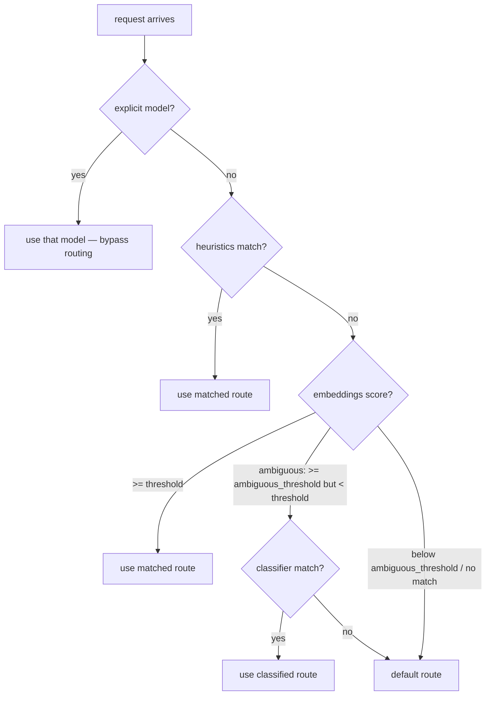

# Semantic Routing

When a request arrives without a `model` field (or with `model: auto`), the gateway uses semantic routing to decide which backend model should handle it. Routing uses a three-layer cascade: fast heuristic rules are tried first, then embedding-based similarity, then an LLM classifier. Each layer can either make a confident decision, decline and pass to the next layer, or (in the case of embeddings) flag an ambiguous result for the classifier to resolve.

If no layer produces a match, the request falls back to a configured default route.

## Quick Start

A minimal routing config with two routes:

```yaml
routing:
  default_route: general

  semantic:
    enabled: true
    provider: local
    model: nomic-embed-text
    threshold: 0.75
    ambiguous_threshold: 0.5

  routes:
    - name: coding
      model: claude-haiku-4-5-20251001
      description: "code generation, debugging, and technical tasks"
      examples:
        - "write a python function to sort a list"
        - "debug this segfault in my C code"

    - name: general
      model: qwen3-vl:30b
      description: "general knowledge and conversation"
      examples:
        - "what is the capital of France"
        - "explain how photosynthesis works"
```

This gives you embedding-based routing with a fallback. The sections below explain every piece of the system.

## The Routing Cascade

The router evaluates layers in order and stops at the first confident result.



When embeddings are not configured at all, an enabled classifier runs directly after heuristics as the primary classification layer; when embeddings are configured, the classifier is consulted only for results in the ambiguous window (see [When the Classifier Runs](#when-the-classifier-runs)).

Each step appends to a **cascade log** that appears in the gateway's log output. For example:

```
semantic routing: method=semantic route='coding' model='claude-haiku-4-5-20251001'
  confidence=0.87 latency=12ms cascade=[heuristic:no_match,semantic:coding:0.87]
```

This tells you that heuristics found no match, then embeddings confidently matched the `coding` route at 0.87.

### Explicit Model Passthrough

If the client sends a `model` field and `allow_explicit_model` is true (the default), the router uses that model directly. No layers are evaluated.

```yaml
routing:
  allow_explicit_model: true  # default; set false to force all requests through routing
```

### The `auto` Virtual Model

Clients that always require a `model` field (such as Open WebUI) can send `model: auto`. The gateway clears this to an empty string before routing, which triggers the full cascade. When semantic routing is enabled, `auto` appears in the `/v1/models` endpoint so clients can discover it.

## Routes

A **route** maps a name to a backend model and provides the context needed by the embedding and classifier layers.

```yaml
routes:
  - name: coding
    model: claude-haiku-4-5-20251001
    description: "code generation, debugging, code review, and technical programming tasks"
    examples:
      - "write a python function to sort a list"
      - "debug this segfault in my C code"
      - "review this pull request for bugs"
      - "implement a binary search tree in Go"
```

| Field | Used by | Purpose |
|---|---|---|
| `name` | all layers | identifier referenced by heuristic rules, cascade logs, and classifier output |
| `model` | all layers | the backend model to use when this route is selected |
| `description` | classifier | included in the classifier prompt so the LLM understands what each route is for |
| `examples` | embeddings | converted to embedding vectors at startup for similarity matching |

You can define as many routes as you need. A route with no `examples` is invisible to the embedding layer but can still be reached by heuristics or the classifier. If the embedding layer is enabled, at least one route must carry examples -- a semantic config where no route has any is refused at startup, since the matcher could never select a route (and would silently shadow an enabled classifier).

## Sterling capability aliases

Sterling uses the gateway's route map as the realization of its signed `sterling-classes/v1` vocabulary. A token-governed capability run carries its coordinate in the existing OpenAI `model` field:

```json
{"model":"sterling-capability:sterling-classes/v1/frontier-coding","messages":[...]}
```

The gateway recognizes this strict virtual-model namespace and resolves the closed v1 class `frontier-coding` to that configured route's concrete model before provider dispatch. The normal OpenAI completion response reports that concrete model. Unknown vocabularies and classes fail before dispatch, even if a route happens to share the unknown class's name. API-key route and concrete-model restrictions both apply. Sterling records the first response binding and sends the concrete model on later turns.

Capability aliases are an explicit model-selection mechanism. A gateway configured with `routing.allow_explicit_model: false` rejects them rather than silently discarding the signed class and running the ordinary semantic cascade.

## Layer 1: Heuristics

Heuristics are fast, deterministic rules evaluated before any model calls. They are useful for requests that can be classified by simple signals without computing embeddings.

```yaml
heuristics:
  enabled: true
  rules:
    - match:
        keywords: ["translate", "translation"]
      route: general
    - match:
        has_tools: true
      route: tools
    - match:
        system_prompt_contains: "you are a code assistant"
      route: coding
    - match:
        max_tokens_lt: 100
        message_length_lt: 200
      route: fast
```

Rules are evaluated in order. The **first matching rule** wins.

### Match Conditions

Each rule has a `match` block with one or more conditions. All specified conditions must be true for the rule to match (AND logic). Omitted conditions are ignored.

**`keywords`** -- a list of keywords matched against user messages (not system messages). Keywords are matched with word boundaries and are case-insensitive. Any single keyword matching is sufficient. Keywords containing non-word characters (like `c++`) are handled correctly -- word boundaries are only applied at edges that touch a letter, digit, or underscore.

**`exclude`** -- a list of phrases that suppress a keyword match. Uses the same word-boundary, case-insensitive matching as keywords. If any exclusion phrase is found in user messages, the rule's keywords are not evaluated and the rule does not match. This prevents false positives from boilerplate text. For example, Open WebUI meta-prompts contain "markdown code fences" which would trigger a bare `code` keyword -- adding `exclude: ["code fences"]` suppresses that.

**`system_prompt_contains`** -- a substring matched against the content of any system message. Case-insensitive.

**`max_tokens_lt`** -- matches if the request's `max_tokens` is set and is strictly less than the given value. Does not match if `max_tokens` is absent.

**`message_length_lt`** -- matches if the total character count across all messages is strictly less than the given value.

**`has_tools`** -- matches if the request includes tool definitions (`true`) or does not (`false`).

### Combining Conditions

When a rule specifies multiple conditions, all must match:

```yaml
- match:
    keywords: ["code"]
    has_tools: true
  route: coding
```

This matches only if a user message contains "code" **and** the request has tools.

### Exclusions

When using broad keywords, you may encounter false positives from boilerplate text injected by clients. The `exclude` field lets you suppress a keyword match when specific phrases are present:

```yaml
- match:
    keywords: ["code", "debug", "refactor"]
    exclude: ["code fences", "code block", "### Task"]
  route: coding
```

Exclusions are checked first. If any exclusion phrase matches, the rule is skipped entirely -- keywords are not evaluated. This is useful when routing requests from clients like Open WebUI that send follow-up meta-prompts (title generation, tagging) containing boilerplate like "without any markdown code fences."

## Layer 2: Embeddings

The embedding layer converts text into numerical vectors and uses cosine similarity to find the closest route. It is the primary classification mechanism for most setups.

### How It Works

At startup, each route's example prompts are sent to an embedding model. The resulting vectors are stored in memory. When a request arrives, the last user message is embedded the same way, and its vector is compared against each route's stored vectors.

Messages longer than 2048 characters are truncated before embedding.

### Configuration

```yaml
semantic:
  enabled: true
  provider: local           # local or openai
  model: nomic-embed-text   # embedding model name
  threshold: 0.75           # minimum similarity for a confident match
  ambiguous_threshold: 0.5  # below threshold but above this -> escalate to classifier
  comparison: centroid       # centroid, max, or average
  cache_embeddings: true     # cache prompt embeddings to avoid repeated model calls
  cache_ttl: 3600            # cache entry lifetime in seconds (default: 3600)
  cache_size: 1000           # maximum cache entries (default: 1000)
```

### Embedding Providers

**Ollama** -- calls `POST /api/embed` with `{"model": "<model>", "input": ["text1", "text2"]}`. No API key needed. When using multi-endpoint mode, embedding requests are sent through the same round-robin client used for chat completions.

**OpenAI** -- calls `POST /v1/embeddings` with an `Authorization: Bearer` header. Requires `api_key` in the provider config.


### Comparison Modes

The `comparison` setting controls how the incoming prompt's embedding is compared against a route's example embeddings.

#### `centroid` (default)

At startup, all example embeddings for a route are averaged element-wise into a single **centroid** vector -- the "center of gravity" of the examples. At request time, the prompt is compared against this one point per route.

- Fastest option: one cosine comparison per route regardless of example count.
- Works well when examples cluster around a common theme.
- Can lose signal if examples are diverse -- the centroid drifts toward the middle and may not strongly represent any individual example.

#### `max`

The prompt is compared against every example individually. The highest score is used.

- Catches requests that closely match even one example, even when other examples in the route are very different.
- Good when a route covers several distinct sub-topics (e.g., a "coding" route that handles both Python debugging and Go code review).
- More prone to false positives: a single outlier example can attract unrelated requests.
- Slower: one comparison per example per route.

#### `average`

The prompt is compared against every example individually. The mean score is used.

- Rewards broad similarity across many examples rather than a strong match to just one.
- Less aggressive than `max`, less reductive than `centroid`.
- Same speed cost as `max`.

#### Choosing a Mode

| Situation | Recommended mode |
|---|---|
| Examples per route are similar to each other | `centroid` |
| A route covers several distinct sub-topics | `max` |
| You want balanced "generally like this route" scoring | `average` |
| Many examples per route and you care about latency | `centroid` |

With a handful of examples per route (3-5), the performance difference is negligible. Start with `centroid`. Switch to `max` if you find that requests closely matching a specific example are being missed because the centroid has drifted.

### Thresholds

Two thresholds control what happens with the embedding layer's result:

```
score >= threshold               -> confident match, return immediately
ambiguous_threshold <= score < threshold -> ambiguous, escalate to classifier
score < ambiguous_threshold      -> no match, continue to next layer
```

- **`threshold`** -- the minimum similarity for a confident match. If the best route scores at or above this, the embedding layer returns that route directly without consulting the classifier. Reasonable starting values: 0.7-0.85.

- **`ambiguous_threshold`** -- the minimum similarity for an ambiguous result. Scores in the range `[ambiguous_threshold, threshold)` are escalated to the classifier (if enabled) for a second opinion. Scores below this are treated as no signal. Reasonable starting values: 0.4-0.6.

The right values depend on your embedding model, how many routes you have, and how distinct your routes are. Models like `nomic-embed-text` tend to produce higher similarity scores across the board than some other models, so you may need higher thresholds.

### Embedding Cache

When `cache_embeddings` is true, prompt embeddings are cached in an LRU cache keyed by the SHA-256 hash of the prompt text. This avoids calling the embedding model again for identical prompts.

- `cache_size` -- maximum number of cached embeddings (default: 1000). When full, the least recently used entry is evicted.
- `cache_ttl` -- how long entries remain valid in seconds (default: 3600). Expired entries are removed on access.

The cache is thread-safe. For most workloads, the defaults are fine. Increase `cache_size` if you see a high volume of distinct prompts and want to improve hit rates.

## Layer 3: LLM Classifier

The classifier sends the user's prompt to a chat model and asks it to classify the request into one of the configured routes. It is typically used as a fallback for ambiguous embedding results, but can also run standalone when embeddings are disabled.

### How It Works

The classifier constructs a prompt like this:

```
Classify the following user request into one of these categories.

Categories:
- coding: code generation, debugging, code review, and technical programming tasks
- general: general knowledge, conversation, translations, and everyday questions

User request:
write a python function to sort a list

Respond with JSON only: {"category": "<name>", "confidence": <0.0-1.0>}
```

It sends this as a `/v1/chat/completions` request to the configured provider and parses the JSON response. The model can wrap its response in markdown code blocks -- the classifier strips those automatically.

The returned `category` is matched case-insensitively against route names. If the model returns a category that doesn't match any route, the result is discarded.

### Configuration

```yaml
classifier:
  enabled: true
  provider: local            # local or openai
  model: qwen3-vl:30b       # any model that supports /v1/chat/completions
  prompt: "Classify the request" # optional; categories and JSON schema are appended
  timeout_ms: 10000          # request timeout in milliseconds (0 = no timeout)
  confidence_threshold: 0.7  # minimum confidence to accept the classification
  cache_results: true        # cache classification results
  cache_ttl: 3600            # cache entry lifetime in seconds (default: 3600)
  cache_size: 500            # maximum cache entries (default: 500)
```

### When the Classifier Runs

The classifier is invoked in two scenarios:

1. **Ambiguous embedding result** -- the embedding layer found a route but the score fell between `ambiguous_threshold` and `threshold`. The classifier acts as a tiebreaker.
2. **No embedding layer** -- if `semantic.enabled` is false (or not configured) but `classifier.enabled` is true, the classifier runs directly after heuristics as the primary classification mechanism.

The classifier's result is accepted only if the confidence meets or exceeds `confidence_threshold`.

### Classifier Cache

When `cache_results` is true, classification results are cached in an LRU cache keyed by the SHA-256 hash of the last user message. Same eviction and TTL behavior as the embedding cache.

### Route Descriptions Matter

The classifier relies on the `description` field of each route to understand what it represents. Write descriptions that are specific enough for an LLM to distinguish between routes. Vague descriptions like "miscellaneous tasks" will produce poor classifications.

## Default Route

If no layer produces a confident result, the gateway uses the default route:

```yaml
routing:
  default_route: general
```

If `default_route` is not set, the first route in the `routes` list is used as an absolute fallback.

## Full Configuration Reference

```yaml
routing:
  allow_explicit_model: true    # let clients bypass routing with an explicit model (default: true)
  default_route: general        # fallback route name

  heuristics:
    enabled: true
    rules:
      - match:
          keywords: [...]               # list of keywords (OR logic within, AND with other conditions)
          exclude: [...]                # phrases that suppress a keyword match (optional)
          system_prompt_contains: "..."  # substring match on system messages
          max_tokens_lt: 100             # max_tokens strictly less than value
          message_length_lt: 200         # total message chars strictly less than value
          has_tools: true                # true or false
        route: route_name

  semantic:
    enabled: true
    provider: local              # local or openai
    model: nomic-embed-text      # embedding model
    threshold: 0.75              # confident match threshold
    ambiguous_threshold: 0.5     # ambiguous escalation threshold
    comparison: centroid          # centroid, max, or average (default: centroid)
    cache_embeddings: true        # enable embedding cache (default: false)
    cache_ttl: 3600               # cache TTL in seconds (default: 3600)
    cache_size: 1000              # cache capacity (default: 1000)

  classifier:
    enabled: true
    provider: local              # local or openai
    model: qwen3-vl:30b         # classifier model
    prompt: "Classify the request" # optional classifier policy/instruction
    timeout_ms: 10000            # request timeout (default: 0 / no timeout)
    confidence_threshold: 0.7    # minimum confidence (default: 0)
    cache_results: true           # enable result cache (default: false)
    cache_ttl: 3600               # cache TTL in seconds (default: 3600)
    cache_size: 500               # cache capacity (default: 500)

  routes:
    - name: coding
      model: claude-haiku-4-5-20251001
      description: "code generation, debugging, and technical tasks"
      examples:
        - "write a python function to sort a list"
        - "debug this segfault in my C code"
```

## Tuning Tips

**Start simple.** Enable only the embedding layer with a few well-chosen examples per route. Add heuristics and the classifier later if needed.

**Add more examples before switching comparison modes.** Four well-chosen examples often solve problems that changing `comparison` from `centroid` to `max` won't.

**Keep examples realistic.** Use prompts that look like what users actually send, not idealized descriptions.

**Use heuristics for obvious cases.** If every request containing "translate" should go to the same route, a keyword heuristic is faster and more reliable than embedding similarity.

**Watch the cascade logs.** The gateway logs the full cascade for every routed request, showing which layers were consulted and what scores they produced. This is the best way to understand why a request was routed where it was.

**Use metrics for aggregate tuning.** With `metrics.enabled: true`, routing decisions are recorded as counters by method (heuristic, semantic, classifier, default). A high proportion of `default` decisions suggests your thresholds are too strict or your examples don't cover your traffic well.

**Tune thresholds with real traffic.** The right `threshold` and `ambiguous_threshold` values depend on your embedding model and route structure. Start with the defaults, watch the confidence scores in the logs, and adjust.
